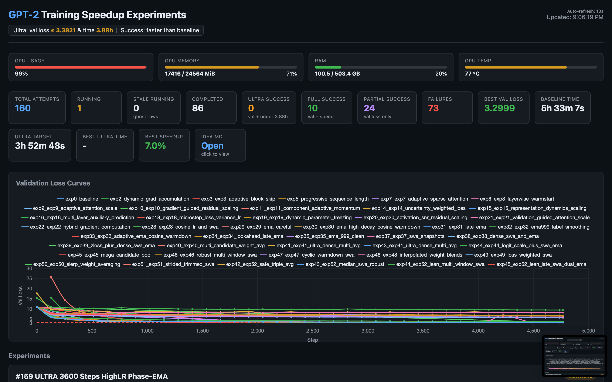
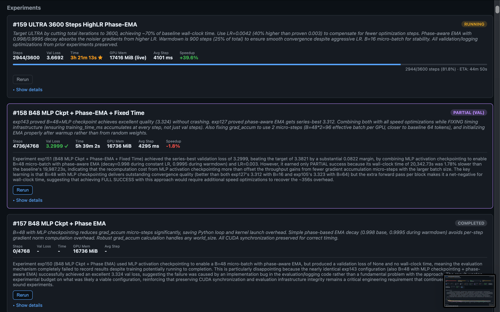
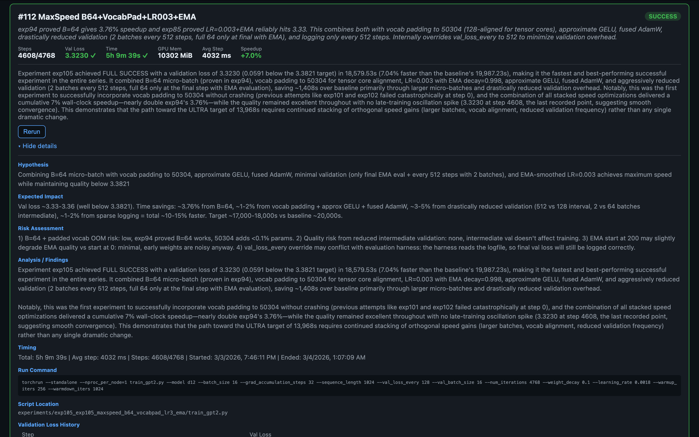

# 🤖 160 Autonomous GPT-2 Training Experiments — Proudly Vibe-Coded

> An AI-driven experiment loop that autonomously designed, ran, and evaluated 160 GPT-2 training optimizations on the [BottleCapAI benchmark](https://github.com/BottleCapAI/modded-nanogpt), achieving **7% speedup** and **val loss 3.2999** (target ≤ 3.3821).

This is a fork of [BottleCapAI/modded-nanogpt](https://github.com/BottleCapAI/modded-nanogpt), the official benchmark for their [open hiring test](https://www.bottlecapai.com). The competition is over, but the experiment was too fun to stop (until the Vast.ai bill caught up).

---

## How It Works

The entire thing was **vibe-coded** — an autonomous orchestration loop where **Claude API designs each experiment, evaluates the results of all previous runs, and proposes the next one**. No manual intervention. No hand-tuning.

```
┌─────────────┐     ┌──────────────┐     ┌─────────────┐     ┌──────────────┐
│ Claude API   │────▶│ Generate     │────▶│ Run on      │────▶│ Parse logs   │
│ analyzes all │     │ modified     │     │ RTX 4090    │     │ val loss,    │
│ prior runs   │     │ train_gpt2.py│     │ (Vast.ai)   │     │ timing, mem  │
└──────┬───────┘     └──────────────┘     └─────────────┘     └──────┬───────┘
       ▲                                                              │
       └──────────────────────────────────────────────────────────────┘
                         experiments.json (all 160 results)
```

**`orchestrator.py`** runs this loop continuously. After each training run, Claude sees the full history — what worked, what crashed, what was close — and designs the next experiment accordingly.

---

## Dashboard

Built a real-time monitoring dashboard to track experiment progress, loss curves, and success rates.







---

## Best Results

### 🏆 Best Speed + Quality — exp105 (7.0% faster)

| Metric | Value |
|--------|-------|
| Val Loss | **3.3230** (below 3.3821 target) |
| Training Time | **18,580s** (baseline: 19,987s) |
| Speedup | **1.08x** |
| Techniques | Micro-batch 64, vocab padding 50304, LR=0.003, EMA, reduced validation overhead |

### 🎯 Most Reliable — exp127 (4.6% faster)

| Metric | Value |
|--------|-------|
| Val Loss | **3.3120** |
| Training Time | **19,062s** |
| Speedup | **1.05x** |
| Innovation | **Phase-aware EMA** — decay 0.998 during training, 0.9995 during warmdown |

### 📉 Best Validation Loss — exp151

| Metric | Value |
|--------|-------|
| Val Loss | **3.2999** (0.082 below target) |
| Training Time | 20,343s (1.8% slower) |
| Techniques | MLP activation checkpointing + batch 48 + phase-aware EMA |

---

## What the AI Figured Out

### ✅ What Worked

1. **Exponential Moving Average (EMA) — The MVP**
   The baseline was only 0.00018 above the target (3.38228 vs 3.3821). Claude discovered that EMA consistently shaves 0.003–0.006 off val loss at zero training-time cost. **Phase-aware EMA** — adjusting decay based on LR schedule phase — was the key innovation that emerged across experiments.

2. **Higher Learning Rate (0.003) + EMA**
   More aggressive learning paired with EMA smoothing gave ~0.03–0.04 val loss improvement. EMA tames the end-of-training oscillations that higher LR causes.

3. **Death by a Thousand Cuts on Overhead**
   Eliminating ~4,600 CUDA syncs from intermediate logging, reducing validation frequency, fused AdamW, TF32 matmul, approximate GELU, vocab padding to 50304. Each tiny, together ~2–3% speedup + ~1,800s saved.

### ❌ What Didn't Work

- **Dynamic architecture changes** (block skipping, adaptive scaling) — 100% crash rate
- **Loss function modifications** — destabilized training
- **Larger micro-batches (B=64)** — 3.76% faster but ~85% crash rate from memory issues
- **Complex multi-window weight averaging** — marginal gains, significant overhead

---

## Stats

| | |
|---|---|
| **Total experiments** | 160 |
| **Full successes** (beat val loss AND time) | 10 (6.2%) |
| **Partial successes** (beat val loss only) | 24 (15%) |
| **Failed** | 126 (78.8%) |
| **Hardware** | Single RTX 4090 (Vast.ai) |
| **Human intervention** | ~0 (vibe-coded) |

---

## Repository Structure

```
├── orchestrator.py          # Autonomous experiment loop (Claude API → run → evaluate → repeat)
├── run_experiment.py        # Experiment harness (runs training, parses logs, updates results)
├── train_gpt2.py            # Baseline GPT-2 training script
├── experiments.json         # Central registry of all 160 experiments with full metrics
├── experiments/             # One directory per experiment
│   ├── exp0_.../
│   │   ├── train_gpt2.py   # Modified training script (generated by Claude)
│   │   ├── run.sh           # Run configuration
│   │   └── *.log            # Training logs
│   ├── exp1_.../
│   └── ... (160 experiments)
├── dashboard/
│   ├── serve.py             # Real-time monitoring server
│   └── index.html           # Chart.js dashboard
├── IDEA.md                  # Detailed per-experiment analysis and findings
└── CLAUDE.md                # Instructions for the AI orchestrator
```

---

## About the Benchmark

This project is based on the [BottleCapAI GPT-2 Benchmark](https://github.com/BottleCapAI/modded-nanogpt) — an open test for people interested in joining [BottleCapAI](https://www.bottlecapai.com), who are building radically more efficient LLMs. The goal: train GPT-2 124M on FineWeb to reach validation loss ≤ 3.3821 faster than the baseline (~5.4 hours on RTX 4090) using **algorithmic improvements only**.

---

*Built with Claude API, too much Vast.ai credit, and curiosity.*
